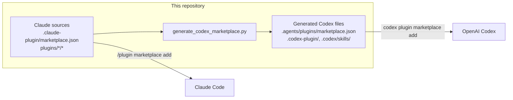
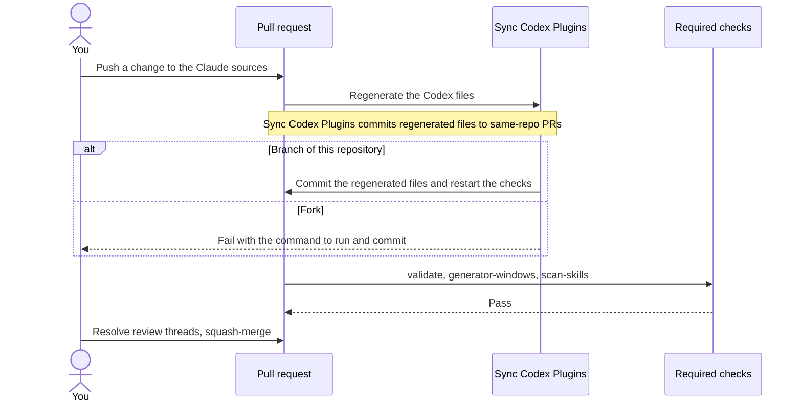

<p align="center">
  <a href="https://www.stackone.com">
    <picture>
      <source media="(prefers-color-scheme: dark)" srcset="docs/assets/stackone-logo-white.svg">
      
    </picture>
  </a>
</p>

# powerful-plugins

[](https://scorecard.dev/viewer/?uri=github.com/StackOneHQ/powerful-plugins)

Plugins for Claude Code and OpenAI Codex that we built at StackOne for our own day-to-day work:
design and data visualization, writing, getting pull requests through AI review, browser
automation, learning from past sessions, spoken notifications and conversation export.

None of them needs a StackOne account, and there's nothing StackOne-specific inside them. We
use them every day and thought other people would find them useful too. Every plugin installs
from this one repository into either tool.

## Quick start

In Claude Code:

```bash
/plugin marketplace add StackOneHQ/powerful-plugins
/plugin install <plugin-name>@powerful-plugins
```

In OpenAI Codex:

```bash
codex plugin marketplace add StackOneHQ/powerful-plugins
codex plugin list --marketplace powerful-plugins
codex plugin add <plugin-name>@powerful-plugins
```

For example, `/plugin install tufte-viz@powerful-plugins` or
`codex plugin add tufte-viz@powerful-plugins`. In Claude Code, `/plugin` on its own lets you
browse the catalog.

## Plugins

| Plugin | Category | What it does |
|--------|----------|--------------|
| `animation-studio` | Design | Plans and builds web animations, scroll-driven 3D explainers and short videos from a rough spec, with the Web Animations API, Motion, anime.js, Three.js and Remotion. |
| `decision-artifacts` | Design | Turns findings, options, plans and status updates into short, evidence-backed pages that help people decide. |
| `tufte-viz` | Design | Designs and critiques charts with Edward Tufte's principles: data-ink ratio, graphical integrity, small multiples and sparklines. |
| `natural-writing` | Documentation | Writes and edits prose that reads like a person wrote it, with a mechanical checker and a review command. |
| `browser-recorder` | Engineering | Records browser sessions from a shot list: screenshots, video clips and a mouse event log for editing afterwards. |
| `spark` | Engineering | Finds the most useful next addition to a change, pressure-tests plans and strips AI slop from code, and runs read-only simplification audits. |
| `reflect` | Engineering | Learns from the current session, or from your session history, git changes and review feedback, and proposes fixes to your skills and guidance. |
| `review-loop` | Engineering | Gets a pull request through every AI code reviewer on it (Copilot, cubic, Greptile, CodeRabbit and others): triggers each one, verifies every comment, fixes or declines it, and repeats until they're all clean. |
| `browser-automation` | Engineering | Picks the right browser tool for the job: the agent's own browser extension, agent-browser, Playwright or Chrome DevTools. |
| `cc-print` | Productivity | Exports Claude Code and Codex conversations to terminal-styled PNG, SVG, PDF or HTML. |
| `say-hooks` | Productivity | Tells you out loud when a turn finishes or the agent is waiting on you, with offline [stackvox](https://github.com/StackOneHQ/stackvox) voices or the macOS `say` fallback. |

Some of these build on other people's plugins. We pin each one to a commit we've reviewed (the
`sha` in `.claude-plugin/marketplace.json`), and Claude Code and Codex both install that exact
commit:

| Plugin | Category | Upstream | Used by |
|--------|----------|----------|---------|
| `agent-browser` | Engineering | [vercel-labs/agent-browser](https://github.com/vercel-labs/agent-browser) | `browser-automation`, `browser-recorder`, `tufte-viz` |
| `pr-review-toolkit` | Engineering | [anthropics/claude-plugins-official](https://github.com/anthropics/claude-plugins-official/tree/main/plugins/pr-review-toolkit) | `spark` |
| `remotion-best-practices` | Design | [remotion-dev/skills](https://github.com/remotion-dev/skills) | `animation-studio` |
| `skill-creator` | Engineering | [anthropics/claude-plugins-official](https://github.com/anthropics/claude-plugins-official/tree/main/plugins/skill-creator) | `reflect` |
| `vercel-web-design-guidelines` | Design | [vercel-labs/agent-skills](https://github.com/vercel-labs/agent-skills/tree/main/skills/web-design-guidelines) | `decision-artifacts` |

Each local plugin has its own `README.md` under `plugins/<category>/<plugin>/`, and the pinned
ones are documented upstream. This table can fall behind, so here's how to list the live catalog:

```bash
jq '[.plugins[] | {name, category, source}]' .claude-plugin/marketplace.json
```

## How the marketplace works

There's one source of truth, written by hand in the Claude Code format:
`.claude-plugin/marketplace.json` and each plugin's `.claude-plugin/plugin.json`, skills,
commands, agents, hooks and MCP config. A generator turns that into the Codex catalog
(`.agents/plugins/marketplace.json`), a `.codex-plugin/plugin.json` per plugin, and Codex skill
adapters for anything Codex doesn't support directly, such as slash commands and subagents. Both
sets of files are committed.



Installation never runs the repository generator. Both tools read files that are already
committed, so generating is a contributor step. After any change to a plugin or the catalog, you
run:

```bash
python3 scripts/generate_codex_marketplace.py          # write the Codex files
python3 scripts/generate_codex_marketplace.py --check  # fail if they're out of date
```

You rarely need to run it yourself on a pull request, though:



Every pull request targeting `main` runs:

- the generator drift check and the unit tests;
- a check that every plugin you changed has a new version;
- validation of both catalogs and every pinned upstream commit;
- real installs of every plugin in pinned versions of Claude Code and Codex;
- the generator on Windows;
- a [SkillSpector](https://github.com/NVIDIA/skillspector) security scan of every skill,
  command, agent, hook and script you changed, which blocks the merge on a high-risk finding.

After merge, the `main` push runs validation again and scans every plugin in report-only mode.

`main` only changes through squash-merged pull requests. The three checks above must pass, every
review thread must be resolved, and nobody can force-push or bypass the rules. On top of that,
[cubic](https://cubic.dev) reviews each pull request using the rules in
[`cubic.yaml`](cubic.yaml). Those rules cover what CI can't check mechanically: no company or
personal details in plugins, instructions that work in both tools, skill descriptions that say
when to use them, hooks and scripts that are safe on a stranger's machine, and READMEs that match
what the plugin ships. For pull requests from outside the team, a maintainer starts that review.

## Contributing

Pull requests are welcome, from the StackOne team and from anyone else. The short version:

1. Copy `templates/plugin-template/` to `plugins/<category>/<plugin-name>/`.
2. Fill in `.claude-plugin/plugin.json`, the skills, commands or agents, and a `README.md`.
3. Add one entry to `.claude-plugin/marketplace.json`. Don't edit the Codex files by hand.
4. Run the generator and the checks below, then open a pull request.

Bump a plugin's version every time you change it, in its `plugin.json` and its catalog entry.
Installs are cached by version, so a change merged without a bump never reaches anyone who
already has the plugin.

A plugin belongs here if anyone could use it. If it needs a StackOne account, API or connector,
it goes in [StackOneHQ/agent-plugins](https://github.com/StackOneHQ/agent-plugins) instead.
[CONTRIBUTING.md](CONTRIBUTING.md), [Creating plugins](docs/creating-plugins.md) and
[Creating skills](docs/creating-skills.md) have the details, and [CLAUDE.md](CLAUDE.md) (also
`AGENTS.md`) holds the ground rules your coding agent should follow in this repo.

### Checks to run locally

```bash
python3 -m venv .venv && . .venv/bin/activate
python3 -m pip install -r requirements-dev.txt

ruff check scripts/*.py tests/*.py
mypy scripts/*.py
python3 -m unittest discover -s tests

python3 scripts/check_plugin_versions.py --base origin/main
python3 scripts/generate_codex_marketplace.py --check
python3 scripts/validate_codex_plugins.py
python3 scripts/validate_external_sources.py
claude plugin validate --strict .

# Install every plugin in a throwaway Claude Code and Codex configuration
python3 scripts/smoke_test_claude_marketplace.py --claude "$(command -v claude)"
python3 scripts/smoke_test_codex_marketplace.py --codex "$(command -v codex)"

# Security scan (needs SkillSpector, see below)
scripts/scan-skills.sh changed origin/main
```

To try a plugin from your checkout:

```bash
/plugin marketplace add /path/to/powerful-plugins
/plugin install cc-print@powerful-plugins

codex plugin marketplace add /path/to/powerful-plugins
codex plugin add cc-print@powerful-plugins
```

## Pinned upstream plugins

Each pinned plugin's source in `.claude-plugin/marketplace.json` names a full 40-character
commit `sha`, and the generator gives Codex the same commit. A plugin at the root of its
repository uses a `github` source (`repo`, `sha`). A plugin in a subdirectory uses `git-subdir`
(`url` as `owner/repo`, `path`, `sha`), because Claude Code ignores `path` on a `github` source
and would install the whole repository.

When an upstream plugin has no Codex packaging, a mapping in
`.agents/plugins/source-overrides.json` makes the generator write a small adapter under
`codex-compat/`. That adapter fetches and verifies the pinned commit the first time you use it,
so in Codex it needs Python 3, Git and HTTPS access to `github.com` once, then reuses the cached
checkout. [Creating plugins](docs/creating-plugins.md#external-plugins) walks through adding one.

## Standalone skills

If you use a Codex IDE integration and don't want a whole plugin, you can copy self-contained
skills into a project:

```bash
./scripts/export-standalone-skills.sh --list
./scripts/export-standalone-skills.sh --dest /path/to/project/.agents/skills <skill-name>
```

The exporter copies complete skill directories and refuses skills that depend on the rest of
their plugin. Install `requirements.txt` first; [Getting started](docs/getting-started.md) has
the details.

## Security scanning

We scan skills and each plugin's `agents`, `commands`, `hooks` and `scripts` folders with
[NVIDIA SkillSpector](https://github.com/NVIDIA/skillspector), looking for prompt injection,
data exfiltration and other risky patterns. The script needs Python 3.12+ and `jq`:

```bash
pip install "git+https://github.com/NVIDIA/skillspector.git@2eb844780ab163f01468ecf142c40a2ec0fcaec0"
scripts/scan-skills.sh all                # every skill and plugin component folder
scripts/scan-skills.sh changed            # only what changed against origin/main
SKILL_ROOT=plugins/engineering/spark scripts/scan-skills.sh all
```

In `changed` mode, a changed plugin file outside every component folder (source code,
`.mcp.json`, `plugin.json`) is scanned on its own, so a version bump doesn't rescan untouched
skills. Scans are static by default; set `SKILLSPECTOR_USE_LLM=1` for LLM analysis and
`REPORT_ONLY=1` to report without failing.

Some plugins do things that look risky on paper and are the whole point, like `say-hooks`
starting a local text-to-speech daemon. Those findings are listed in
`.skillspector-allowlist.json` with their exact rule IDs and the reason, so anyone can see what
was accepted and why. Please report a security problem privately through GitHub's
**Report a vulnerability** button on the Security tab rather than in a public issue.

## About StackOne

[StackOne](https://www.stackone.com) is the Tools Gateway for AI agents. We connect agents to
hundreds of enterprise systems and make those tool calls secure, token-efficient and accurate
enough to run in production. We write a lot of agent tooling to do that, and this repo is where
we share the parts that are useful to anyone.

## Resources

- [Claude Code plugins documentation](https://code.claude.com/docs/en/plugins)
- [Agent Skills specification](https://agentskills.io)

## License

MIT. See [LICENSE](LICENSE).
