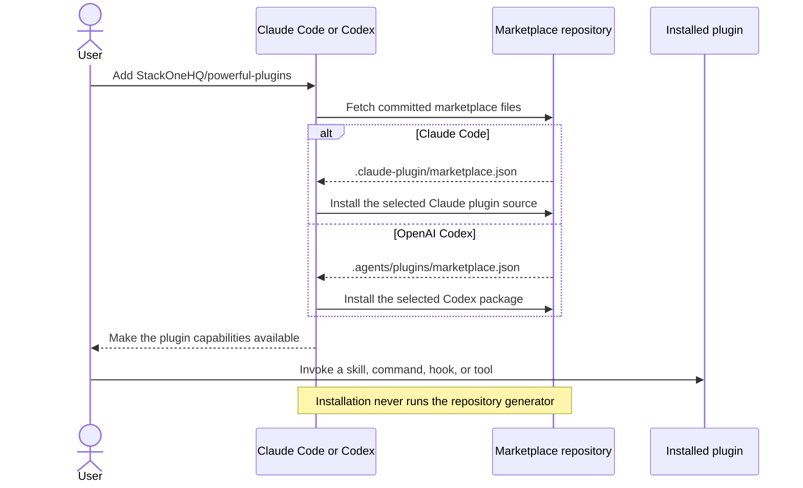
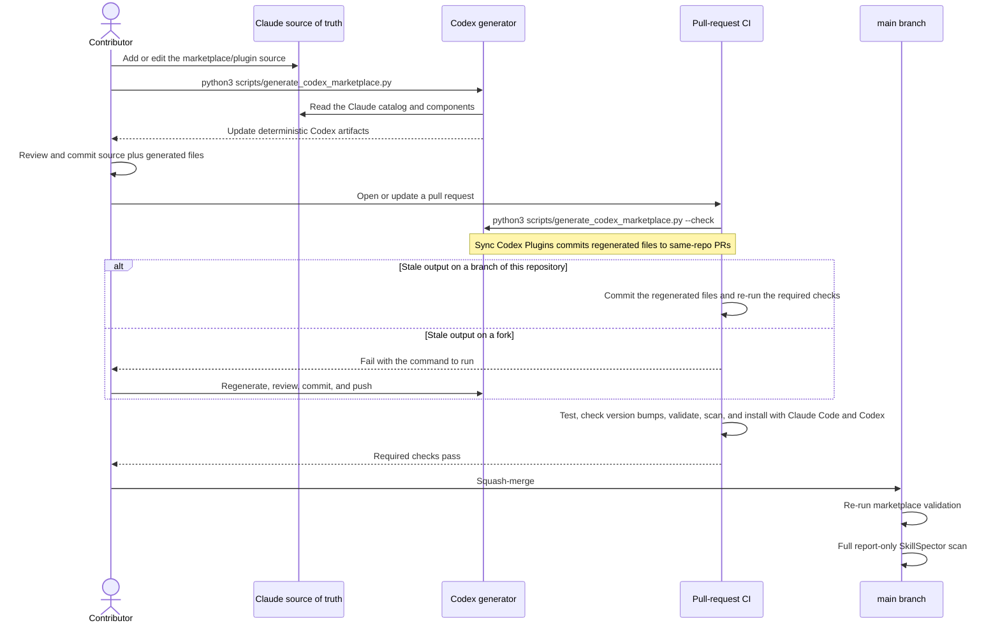

# powerful-plugins

Plugins for Claude Code and OpenAI Codex that the StackOne team built for its own work and
uses every day: design and data visualization, writing, code review loops, browser automation,
session reflection, spoken notifications and conversation export. None of them needs a StackOne
account or anything else from StackOne. Every plugin installs from the same repository into
either tool.

## Quick Start

### Claude Code

```bash
/plugin marketplace add StackOneHQ/powerful-plugins
/plugin install <plugin-name>@powerful-plugins
```

For example, `/plugin install tufte-viz@powerful-plugins`. Run `/plugin` on its own to browse
the catalog.

### OpenAI Codex

```bash
codex plugin marketplace add StackOneHQ/powerful-plugins
codex plugin list --marketplace powerful-plugins
codex plugin add <plugin-name>@powerful-plugins
```

For example, `codex plugin add tufte-viz@powerful-plugins`.

## Available Plugins

| Plugin | Category | What it does |
|--------|----------|--------------|
| `animation-studio` | Design | Plans and builds web animations, scroll-driven 3D explainers and short videos with the Web Animations API, Motion, anime.js, Three.js and Remotion, starting from a rough spec. |
| `decision-artifacts` | Design | Turns findings, options, plans and status into short, evidence-backed interactive pages that help people decide. |
| `tufte-viz` | Design | Designs and critiques charts with Edward Tufte's principles: data-ink ratio, graphical integrity, small multiples and sparklines. |
| `natural-writing` | Documentation | Writes and edits prose that reads as written by a person, with a mechanical checker and a review command. |
| `browser-recorder` | Engineering | Records browser sessions from a shot list: screenshots, video clips and a mouse event log for post-processing. |
| `spark` | Engineering | Finds the most useful next addition to a change, pressure-tests plans, and runs read-only simplification audits. |
| `reflect` | Engineering | Learns from the current session or from session history, git changes and review feedback, and proposes skill and guidance fixes. |
| `review-loop` | Engineering | Gets a pull request through every AI code reviewer on it (Copilot, Cubic, Greptile, CodeRabbit and others): triggers each, verifies and fixes or declines each comment, and repeats until all are clean. |
| `browser-automation` | Engineering | Picks the right browser tool for the job: a native browser extension, agent-browser, Playwright or Chrome DevTools. |
| `cc-print` | Productivity | Exports Claude Code and Codex conversations to terminal-styled PNG, SVG, PDF or HTML. |
| `say-hooks` | Productivity | Speaks when a turn finishes or the agent is blocked, with offline [stackvox](https://github.com/StackOneHQ/stackvox) voices or the macOS `say` fallback. |

Other people's plugins that the plugins above build on. Claude Code and Codex both install each
one at the same reviewed commit, the `sha` in its `.claude-plugin/marketplace.json` source:

| Plugin | Category | Upstream | Used by |
|--------|----------|----------|---------|
| `agent-browser` | Engineering | [vercel-labs/agent-browser](https://github.com/vercel-labs/agent-browser) | `browser-automation`, `browser-recorder`, `tufte-viz` |
| `pr-review-toolkit` | Engineering | [anthropics/claude-plugins-official](https://github.com/anthropics/claude-plugins-official/tree/main/plugins/pr-review-toolkit) | `spark` |
| `remotion-best-practices` | Design | [remotion-dev/skills](https://github.com/remotion-dev/skills) | `animation-studio` |
| `skill-creator` | Engineering | [anthropics/claude-plugins-official](https://github.com/anthropics/claude-plugins-official/tree/main/plugins/skill-creator) | `reflect` |
| `vercel-web-design-guidelines` | Design | [vercel-labs/agent-skills](https://github.com/vercel-labs/agent-skills/tree/main/skills/web-design-guidelines) | `decision-artifacts` |

Each local plugin has its own `README.md` under `plugins/<category>/<plugin>/`; an imported one
documents itself upstream. To list the live
catalog instead of trusting this table:

```bash
jq '[.plugins[] | {name, category, source}]' .claude-plugin/marketplace.json
```

## How the Marketplace Works

This repository exposes one marketplace identity through two committed runtime catalogs.
`.claude-plugin/marketplace.json` is the hand-authored source of truth for Claude Code.
`.agents/plugins/marketplace.json` and each local `.codex-plugin/plugin.json` are
deterministic Codex views generated from that Claude source.

### Installing and Using the Marketplace



Users always consume files already committed to the repository. Generation is a contributor
step, not an installation step. Claude Code reads the Claude catalog and the plugin sources
directly; Codex reads the committed generated catalog and the Codex-only adapters under each
plugin's `.codex/skills/`.

### Contributing a Plugin or Change

Run generation after any marketplace or plugin source change. That covers adding, removing
or renaming a plugin, and changing catalog metadata, manifests, commands, agents, skills,
hooks or MCP packaging. The generator skips files whose bytes are already current.



On a pull request from a branch of this repository, Sync Codex Plugins
(`.github/workflows/codex-sync.yml`) regenerates the Codex files, commits them to the branch,
and starts Validate Plugins and Scan Skills again on the new commit. A pull request from a fork
cannot be pushed to, so there it fails with the command to run.

Every pull request targeting `main` runs the read-only generator drift check, the test and
validation suite, a check that every changed plugin bumped its version, real Claude Code and
Codex installation smoke tests, a Windows run of the generator, and a blocking SkillSpector
scan of changed skills and plugin `agents`, `commands`, `hooks` and `scripts` folders.
After merge, the `main` push reruns validation and scans all of them in report-only mode.

`main` is protected: changes land through a pull request and are squash-merged. The required
checks are `validate`, `generator-windows` and `scan-skills`, every review conversation must be
resolved, and force pushes and branch deletion are blocked.

[cubic](https://cubic.dev) reviews every pull request, using the settings and repository rules
in [`cubic.yaml`](cubic.yaml): plugins stay company-agnostic, versions get bumped, generated
Codex files are never edited by hand, and instructions work in both tools. Pull requests from
outside contributors are reviewed once a maintainer starts the review.

## Repository Structure

```
powerful-plugins/
├── .claude-plugin/
│   └── marketplace.json            # Source registry, hand-authored
├── .agents/plugins/
│   ├── marketplace.json            # Generated Codex marketplace catalog
│   ├── generated-files.json        # Generated ownership index
│   └── source-overrides.json       # Codex adapters for external plugins
├── .github/
│   ├── workflows/                  # Validate Plugins, Scan Skills, Sync Codex Plugins
│   └── CODEOWNERS                  # Who is asked to review each path
├── cubic.yaml                      # AI code review settings and repository rules
├── plugins/
│   ├── design/                     # animation-studio, decision-artifacts, tufte-viz
│   ├── documentation/              # natural-writing
│   ├── engineering/                # browser-*, spark, reflect, review-loop
│   └── productivity/               # cc-print, say-hooks
├── docs/                           # Getting started, plugin and skill authoring guides
├── scripts/
│   ├── generate_codex_marketplace.py     # Generate Codex manifests and adapters
│   ├── validate_codex_plugins.py         # Validate both catalogs and Codex packaging
│   ├── validate_external_sources.py      # Verify pinned upstream commits and paths
│   ├── check_plugin_versions.py          # Fail a change that forgets a version bump
│   ├── smoke_test_claude_marketplace.py  # Real Claude Code install and details smoke test
│   ├── smoke_test_codex_marketplace.py   # Real Codex install and discovery smoke test
│   ├── materialize_pinned_upstream.py    # Fetch and verify a pinned external checkout
│   ├── export-standalone-skills.sh       # Export self-contained skills for Codex IDEs
│   └── scan-skills.sh                    # SkillSpector security scanner
├── templates/                      # Starting points for new plugins and skills
└── tests/                          # Unit tests for the scripts above
```

## Contributing

Contributions are welcome through pull requests. The short version:

1. Copy `templates/plugin-template/` to `plugins/<category>/<plugin-name>/`.
2. Fill in `.claude-plugin/plugin.json`, the skills, commands or agents, and a `README.md`.
3. Add one entry for the plugin to `.claude-plugin/marketplace.json`. Do not edit
   `.agents/plugins/marketplace.json` by hand.
4. Run `python3 scripts/generate_codex_marketplace.py` and commit what it writes.
5. Run the validation commands below and open a pull request.

Bump a plugin's version whenever you change it, in both its `.claude-plugin/plugin.json` and
its catalog entry. Installs are cached by version, so a change merged without a bump never
reaches anyone who already has the plugin. `scripts/check_plugin_versions.py` fails the pull
request when a changed plugin kept its version.

See [CONTRIBUTING.md](CONTRIBUTING.md), [Creating Plugins](docs/creating-plugins.md) and
[Creating Skills](docs/creating-skills.md) for the details.

## Validation

```bash
# One-time setup
python3 -m pip install -r requirements-dev.txt

# Style, types and unit tests
ruff check scripts/*.py tests/*.py
mypy scripts/*.py
python3 -m unittest discover -s tests -v

# Every plugin changed on this branch has a new version
python3 scripts/check_plugin_versions.py --base origin/main

# Generated Codex files are current, and both catalogs are valid
python3 scripts/generate_codex_marketplace.py --check
python3 scripts/validate_codex_plugins.py
python3 scripts/validate_external_sources.py
claude plugin validate --strict .

# Install every plugin in an isolated Claude Code and Codex configuration
python3 scripts/smoke_test_claude_marketplace.py --claude "$(command -v claude)"
python3 scripts/smoke_test_codex_marketplace.py --codex "$(command -v codex)"
```

To try one plugin from a local checkout:

```bash
/plugin marketplace add /path/to/powerful-plugins
/plugin install cc-print@powerful-plugins

codex plugin marketplace add /path/to/powerful-plugins
codex plugin add cc-print@powerful-plugins
```

## External Plugins

The pinned plugins listed under [Available Plugins](#available-plugins) are external. Each one's
source in `.claude-plugin/marketplace.json` names a full 40-character commit `sha`, and the
generator gives Codex the same commit, so both tools use the same upstream revision. Claude Code
installs that commit directly; Codex installs a small local adapter that fetches it on first use. A plugin at the root
of its repository uses a `github` source (`repo`, `sha`); a plugin in a subdirectory uses
`git-subdir` (`url` as `owner/repo`, `path`, `sha`), because Claude Code ignores `path` on a
`github` source and installs the whole repository. When the upstream has no native Codex packaging, a
compatibility mapping in `.agents/plugins/source-overrides.json` makes the generator write a
runtime adapter under `codex-compat/`. In Codex, runtime-adapted externals require
Python 3, Git, and HTTPS access to `github.com` on first invocation; later uses reuse the
verified, cached checkout. See [Creating Plugins](docs/creating-plugins.md#external-plugins).

## Standalone Skills

Codex IDE integrations can use self-contained skills without installing a plugin:

```bash
./scripts/export-standalone-skills.sh --list
./scripts/export-standalone-skills.sh --dest /path/to/project/.agents/skills <skill-name>
```

The exporter copies complete skill directories and refuses skills that depend on their plugin.
Install `requirements.txt` first; see [Getting Started](docs/getting-started.md).

## Security Scanning

Skills, and each plugin's `agents`, `commands`, `hooks` and `scripts` folders, are scanned
with [NVIDIA SkillSpector](https://github.com/NVIDIA/skillspector) for prompt injection, data
exfiltration and other risky patterns. The script needs Python 3.12+ and `jq`.

```bash
pip install "git+https://github.com/NVIDIA/skillspector.git@2eb844780ab163f01468ecf142c40a2ec0fcaec0"
scripts/scan-skills.sh all                # every skill and plugin component folder
scripts/scan-skills.sh changed            # only those changed against origin/main
SKILL_ROOT=plugins/engineering/spark scripts/scan-skills.sh all
```

In `changed` mode, a changed plugin file outside every skill and component folder (source
code, `.mcp.json`, `plugin.json`) is scanned on its own, not with the rest of its plugin, so a
version bump does not rescan untouched skills. Scans are static-only by default.
Set `SKILLSPECTOR_USE_LLM=1` for LLM analysis and `REPORT_ONLY=1` to report without failing. A reviewed high-risk finding can be recorded, with
its exact rule IDs and a rationale, in `.skillspector-allowlist.json`.

## Resources

- [Claude Code plugins documentation](https://code.claude.com/docs/en/plugins)
- [Agent Skills specification](https://agentskills.io)

## License

MIT. See [LICENSE](LICENSE).
